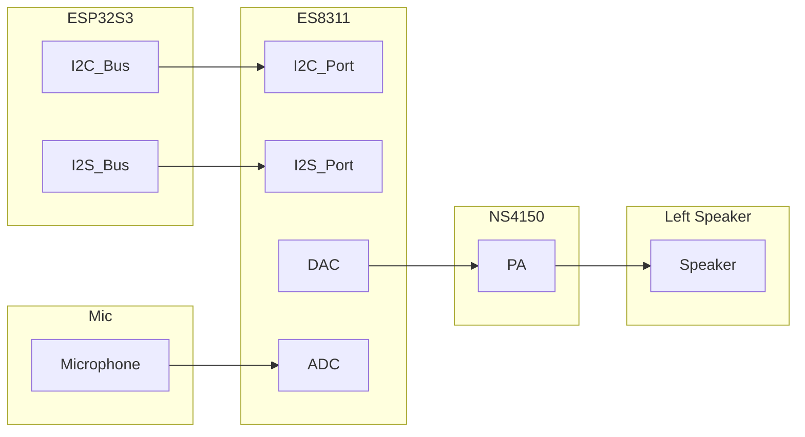
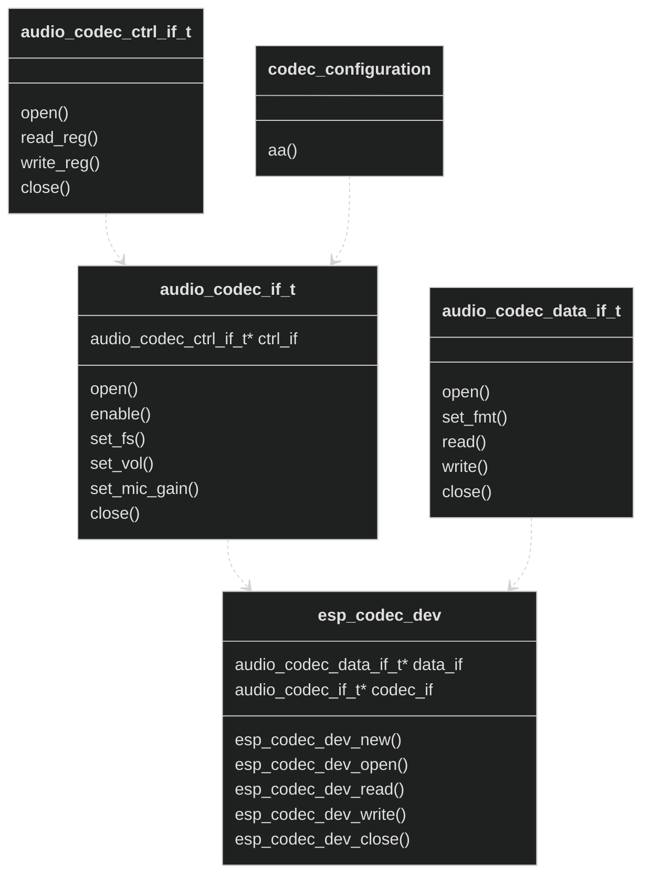

# ESP Codec Device
- [中文版本](./README_CN.md)

## General Information

`esp_codec_dev` is a driver component for audio codec devices.It includes the driver code for commonly used codec chip and provides high level API for playback and record. Meanwhile make it easier to add customized codec driver. The supported codec chip list as belows:

|       |Playback|Record|
| :-----| :---- | :---- |
|ES8311  |Y|Y|
|ES8388  |Y|Y|
|ES8374  |Y|Y|
|ZL38063  |Y|Y|
|TAS6805M  |Y|N|
|ES7210 |N|Y|
|ES7243 |N|Y|
|ES7243E |N|Y|
|ES8156 |N|Y|


## Function overview

In hardware view, the connection between codec device (ES8311) and main IC (ESP32S3) is as belows:





ESP32S3 sends control data to ES8311 through I2S bus and exchanges audio data through I2S bus.  
During playing, ES8311 receive digital audio data from I2S bus and do DAC operation, afterwards analog signal is amplified by PA chip (NS4150) and finally output through speaker. During recording, ES8311 gets analog signal from microphone, amplified the signal and do ADC operation, then digital audio data can be fetched from ESP32S3.

The communication between ESP32S3 and ES8311 happen on two paths:
 1. Control path:
    Which used to setup codec chip (use I2C bus)
 2. Data path:
    Which used to exchange audio data (use I2S bus)
   
`esp_codec_dev` abstracts above two paths into two interfaces: 
`audio_codec_ctrl_if_t` for control path:  
    Control interface mainly offer `read_reg` and `write_reg` API to do codec setup
`audio_codec_data_if_t` for data path:  
    Data interface mainly offer `read` and `write` API to exchange audio data

Using `audio_codec_ctrl_if_t` and codec specified settings, it finally abstract codec interface `audio_codec_if_t`

For easier use, high-level API glue has been added to operate on these interfaces. Each codec device is abstract as an `esp_codec_dev_handle_t`. With the handle users can do playback and recording simply.

With these concepts, following feature are supported:
1. Support for multiple codec device (include same device)
2. Different codec can share the same bus with no conflict
3. New codec can be built up easily
4. Can be ported to other platform easily

## Usage

Follow below steps to do playback and record, take ES8311 codec as a example.
1. Install driver for codec control and data bus  
   `i2s_driver_install` to install i2s driver  
   `i2c_driver_install` to install for i2s driver  

2. Create control and data interface for codec, use the interface provided in default   
   `audio_codec_new_i2c_ctrl`  
   `audio_codec_new_i2s_data`  

3. Create codec interface based on control interface and codec specified configuration  
   `es8311_codec_new`

4. Get `esp_codec_dev_handle_t` through `esp_codec_dev_new`
   Now you can use the handle for further playback and recording as follows:
	```c
	esp_codec_dev_cfg_t dev_cfg = {
		.codec_if = codec_if;                  // codec interface from es8311_codec_new
		.data_if = data_if;                    // data interface from audio_codec_new_i2s_data
		.dev_type = ESP_CODEC_DEV_TYPE_IN_OUT; // codec support both playback and record
	};
	esp_codec_dev_handle_t codec_dev = esp_codec_dev_new(&dev_cfg);
	// Below code show how to play
	esp_codec_dev_set_out_vol(codec_dev, 60.0);
	esp_codec_dev_sample_info_t fs = {
		.sample_rate = 48000,
		.channel = 2,
		.bits_per_sample = 16,
	};
	esp_codec_dev_open(codec_dev, &fs);
	uint8_t data[256];
	esp_codec_dev_write(codec_dev, data, sizeof(data));
	esp_codec_dev_close(codec_dev);

	// Below code show how to record
	esp_codec_dev_set_in_gain(codec_dev, 30.0);
	esp_codec_dev_read(codec_dev, data, sizeof(data));
	esp_codec_dev_close(codec_dev);
	```


## How to customize

1. If codec uses I2C bus for control path and I2S bus for data path.  
   It needs only care internal register settings and implement `audio_codec_if_t`:
	```c
	typedef struct {
		const audio_codec_ctrl_if_t *ctrl_if;     /*!< Codec Control interface */
		const audio_codec_gpio_if_t *gpio_if;     /*!< If you want to operate GPIO */
		//...................................     Other settings
	} my_codec_cfg_t;
	const audio_codec_if_t *my_codec_new(my_codec_cfg_t *codec_cfg);
	```
   
2. If codec use other control path or data path  
   It needs also implement `audio_codec_ctrl_if_t` and `audio_codec_data_if_t`.


For detail information, you can check the sample code [test_codec.c](test/test_codec.c)

## Volume setting

`esp_codec_dev` supports following volume control methods:
1. Use codec register to adjust volume
2. Use builtin software volume  `audio_codec_new_sw_vol` when codec hardware not support volume adjust
3. Use customized software volume interface by `esp_codec_dev_set_vol_handler`

Users can adjust volume through the common API `esp_codec_dev_set_out_vol`.

Volume curve API `esp_codec_dev_set_vol_curve` is provided to customized the detail volume at each point (please sort volume maps in advance).
It will use linear interpolation to calculate the decibel value at certain volume point and set to volume control.

To balance the speaker loudness across different platform when playback the same content, we need know some mechanism of the audio gain. In simple version, audio gain consider of two parts: software gain (adjustable), hardware gain (fixed)
Software gain can be adjusted by adjust the input PCM data level or adjust volume. Hardware gain is affected by the circuit, mostly caused by analog signal amplifier efficient, we extract the typical impact parameter into `esp_codec_dev_hw_gain_t`. 
Software gain can be adjusted by adjust the input PCM data level or adjust volume. Hardware gain is affected by the circuit, mostly caused by analog signal amplifier efficient, we extract the typical impact parameter into `esp_codec_dev_hw_gain_t`. 


   

